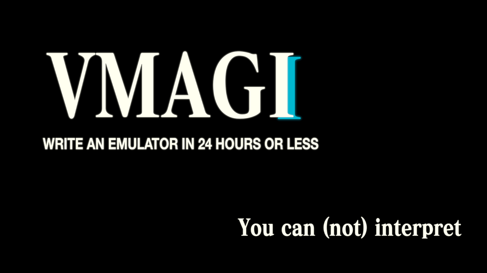

# VMAGI

Welcome! `VMAGI` is a small emulator/interpreter my friend 
[Matthew](https://github.com/matthewsanetra) 
and I
challenged each other to build in 24 hours. This includes both the implementation of the interpreter
and creating your own ISA/3ac/IR for it that it will run on top of. 
If you want to see Matthew's implementation, go to 
[his repository](https://github.com/matthewsanetra/sandy_isa)

My friend [Ethan](https://github.com/ephing) also joined us on this competition
and completed [his implementation](https://github.com/ephing/not-fake-assembly-language).

Funnily enough, I did it in Go, Matthew in Rust, Ethan in C++. 

## Basics

The goal within 24 hours was to write an interpreter that can reliably run a recursive version
of fibonacci sequence, such that for any natural `n`, `fib(n)` returns the `n`th element of the
sequence. 

This was an interesting challenge, as writing the machine itself, with all the instructions and 
logic around it was pretty simple. This includes required stuff like labels, jumps, conditionals,
etc. The idea was to make it a workable interpreter for whatever you write. 

Matthew and I both have the same direction, in terms of what our interpreters should achieve. Besides
being able to run recursive fibonacci, it should have a command/opcode `halt` that will immediately
halt the interpreter and return the value that was passed to `halt` with either registers or some
other way.

In the end of the competition, which is right now as I'm writing it, `VMAGI` has a total of 25 opcodes.
You see, I have a very classical Computer Science training, so I think in terms of memory layout, IO-bound
operations, and etc. For more details, see `isa.go` for the list of instructions and how the look like.

## Fibonacci example

Here is an example of the recursive fibonacci
```
        addi #1, 30, #1   -- 0 depth is 30
        push #1           -- 1 push depth to parameters
        call @fib!        -- 2 call fib(n)
        pop #1            -- 3 pop the return
        halt #1           -- 4 exit with the return

fib!:   pop #1            -- 5 pop the n param
        jmpz #1, @base0   -- 6 if n==0, jump to @base0
        eqi  #1, 1, #2    -- 7 set #2 = #1 == 1
        jmpt #2, @base1   -- 8 if #1 == 1, jump to @base1
        subi #1, 1, #1    -- 9 set #1 = n - 1
        push #1           -- 10 push n-1 to stack
        call @fib!        -- 11 call fib(n-1)
        pop #2            -- 12 pop result of fib(n-1) to #2
        subi #1, 1, #1    -- 13 set #1 = (n - 1) - 1 = n - 2
        push #1           -- 14 push n-2 to stack
        call @fib!        -- 15 call fib(n-2)
        pop #1            -- 16 pop result of fib(n-2) to #1
        add #1, #2, #1    -- 17 set #1 = #1 + #2 = fib(n-2) + fib(n-1)
        push #1           -- 18 push the fib result to stack
        ret               -- 19 return
        
base0:  pushi 1           -- 20 push 1 to stack
        ret               -- 21 return
        
base1:  pushi 1           -- 22 push 1 to stack
        ret               -- 23 return
```

To which `> VMAGI ./examples/fib.vmagi` outputs
```sh
VMAGI stopped execution with 1346269
```

## My idea

I tried to write `VMAGI` in such a way that its reasonably performant and most of all, dead simple. Simple
as in how it works internally, the way data gets shuffled around, and the cost of maintenance/understanding
the code. To build a simple stack machine is not hard, almost trivial in some places, as all you do is run
the most simple instructions, such as `add` or `push` and put the data somewhere, where it needs to go. 

One of the biggest mistakes you can make is usually just mistyping something or getting some logic nuances
nudged in a different directions. No exception here. I would say the biggest difficulty for this challenge
was the optimization stage and making everything faster, but also not sacrificing the code quality. Also,
because this is Go, I also tried to write everything using *just* the standard library, so no dependencies.

I just wanted to have fun and watch Kill la Kill for the 100th time. The basic version that just runs the code,
as taking in the assembly input, parsing it, and running it, all in all took about 4 hours. The next ~8 hours
were spent on cleaning up the code, improving the logic, tightnening up some holes, and coming up with some
optimizations. 

## How it works

`VMAGI` works in a direct, single-pipeline, sequential way. The only input `VMAGI` requires is the filename
with the `.vmagi` assembly code you want to be interpreted. `VMAGI` will read the file and take care of the
parsing and executing together. You don't need an assembler to pass in the bytecode. 

Parsing is fairly simple. See `parser.go` for that. What `VMAGI` does is read the given file line-by-line and
run a couple of regex expressions to figure out the opcode/command that is invoked with all its operands. Of 
course, you could do it better using a lexer, as Matthew did, like `flex` and use something ala `bison` to 
write down the grammar for our new language. I have done it many times, so I just wanted to have some fun.

After we parsed out the language (label lookups get a deferred parsing), we will have a list of all valid
instructions in our language (See `models.go`). After that, we will be starting on executing each instruction,
by moving the `PC` (Program Counter) pointer where it has to go. For more gory details on the execution logic
and code, please go and see `execute.go`

## Performance

Definitely one of the hardest and most annoying parts of writing `VMAGI` was improving performance on deeply
nested recursive calls. Recall that we had to make an emulator that recursively calculates any member of the
Fibonacci sequence. As you can imagine, every `n`th member of the sequence has to call `n-1` and `n-2`, which
they in return call everything even deeper.

On the first try, smaller values of Fibonacci were working quite reliably but if we start going anywhere above
30 or 40, it started to slow down that you could feel it. `fib(30)` would take about 3 secounds and `fib(40)`
maybe a minute or two. So what do we do? Well, you should always use your trusty `pprof` to see for yourself
where your program spends most of its CPU time and where does the memory go.

Looking at the CPU profile of `VMAGI`, I found that a lot of time was spent on hashing functions (hashtable
lookup for labels and memory), context switching (each `call @func` created a new memory location), function
lookup, and excessive memory accesses. Many of them were fixed by mainly re-engineering my approach to their
logic. Instead of hashing, just index and instead of context switch (which takes a whole allocation), just 
offset into a free pre-allocated part. 

My first benchmark was the `fib(30)`, which would take about 7 seconds to run on a raw machine. After adding
some performance boosts and cleaning the code, it went down to whopping ~250ms. But this was still small fish
to fry. Next big benchmark in sight was `fib(40)`, which even with all the recent improvements takes ~30 seconds
to run. Profiling doesn't help that much, as the low hanging fruit has already been picked.

The biggest bottlenecks in the code now were the `if`s loop that check whether an instruction using an immediate
field, basic variable assignments, stack operations, and most importantely, memory accesses made for variables 
retrieval. But what can I do here? Our `Memory` is just an array. I can't really think of something that is 
considerably faster than straight native indexing. 

I don't want to fight with the language. Instead of focusing my attention onto raw slice access overheads and 
the time it takes to do basic math, I would have to focus on straight optimizations now. Well, I only have an
hour left. I thought that the best way to approach it would be writing some sort of a caching mechanism that
makes executing millions lines of duplicate instructions unnecessary. 

But how would one do caching in an assembly-like language? There are no clear constructs, such as the number
of expected arguments and return values. I called this "Memoization Strategy by Assembly Stack Depth Analysis"
or MSASDA (totally made up). In essens, this is your familiar memoizer that caches the input of a function with
its output. You would ask me, how does the optimizer know if the function is pure? How does it know it has a 
valid structure to be memoized? 

I have an answer just for you. You tell it. Your function can be denoted by a label `fib: ....` but if you want
`VMAGI` to memoize and optimize your function, simply add a bang to the label's signature. So you would declare
it in a way like `fib!: ....`. By this, the programmer gives several guarantees to `VMAGI`: *1)* `fib!` is pure 
with no side-effects (return can be deterministically predicted by input arguments) and *2)* `fib!` takes exactly
one argument and returns exactly one value. 

Point *1)* is a little bit of cheating, because every function in `VMAGI` during its execution gets a whole new
context and the only way for functions on the stack to communicate with each other is to pass data to each
other through pushing and popping off the stack. Point *2)* is a little more strict. Multiple input/return functions,
just anywhere can get pretty ugly (even with python's fancy `lru_cache`). If a programmer *really* needs 
some part of the code to run fast, then divide the problem into subproblem(s) using single-input-output routines.

This made a day&night difference. You remember how `fib(40)` was taking about ~30 seconds to run? It's about 5-7ms
now. As any other fibonacci argument, even when it starts overflowing signed 64-bit integers. Actually, any input
will give you about ~6ms. The noise on my system is greater than the execution time itself, with all the parsing
and caching. I can't even profile this program, because profiler simply can't read that fast. Only makes you see 
the power of caching in one place. All you need to enable this, is to add a bang to a label's (function's) 
signature to tell `VMAGI` to try and cache the calls of this function. 

I would argue it's a good improvement we made here from infinity to ~30s to 7ms. There are many other optimizations
and improvements, but I'm out of time, and satisfied with what the result is in 24 hours since the start of the 
competition. 

## Future work

Of course, there is a lot that can be done to improve `VMAGI`. In particular, something around improving `execute.go`
way of handling immediate value. Each context is limited to ten variables, so you can only address `#1,...,#10` variables
before unholy stuff happens. This could be resized and made more dynamic. This list can go on. For 24 hours, I'm very happy.

## Why VMAGI?

[MAGI](https://evangelion.fandom.com/wiki/Magi) is a supercomputer from Evangelion. I love Evangelion and I wanted
to name it something similar, like `MAGIV`, my friend told me to name it `VMAGI` instead, so here we have it!
